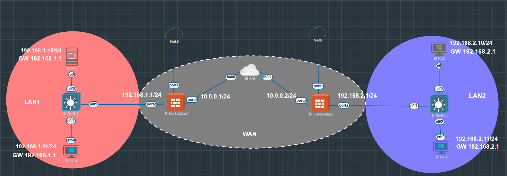

# Lab : VPN Site-à-Site

## 🎯 Objectifs

* Mettre en place une topologie réseau avec deux FortiGate.
* Configurer un VPN IPsec site-à-site entre deux FortiGate.
* Assurer la connectivité entre les réseaux locaux (LAN) via le tunnel VPN.
* Vérifier le fonctionnement du tunnel VPN.

## 📦 Prérequis

* Émulateur réseau (EVE-NG, GNS3) avec les images suivantes :

  * FortiGate (FortiOS)
  * Windows 10 (pour PC1, PC2, PC3, PC4)
  * Switch Ethernet (IOS L2)

## 📌 Topologie



## 🖧 Plan IP

| Réseau | Plage d'adresses IP | Passerelle  |
| ------ | ------------------- | ----------- |
| LAN1   | 192.168.1.0/24      | 192.168.1.1 |
| LAN2   | 192.168.2.0/24      | 192.168.2.1 |
| WAN    | 10.0.0.0/24         | N/A         |

### Adresses IP des équipements

| Appareil   | Interface | Zone/Réseau | Adresse IP   | Passerelle  |
| ---------- | --------- | ----------- | ------------ | ----------- |
| PC1        | e0        | LAN1        | 192.168.1.10 | 192.168.1.1 |
| PC2        | e0        | LAN2        | 192.168.2.10 | 192.168.2.1 |
| PC3        | eth0      | LAN2        | 192.168.2.11 | 192.168.2.1 |
| PC4        | eth0      | LAN1        | 192.168.1.11 | 192.168.1.1 |
| FortiGate1 | port2     | LAN1        | 192.168.1.1  | N/A         |
| FortiGate1 | port3     | WAN         | 10.0.0.1     | N/A         |
| FortiGate2 | port2     | LAN2        | 192.168.2.1  | N/A         |
| FortiGate2 | port3     | WAN         | 10.0.0.2     | N/A         |

---

## 🔧 Instructions de Configuration

### 1️⃣ Configuration initiale des FortiGate

#### FortiGate1

```fortios
config system interface
  edit "port2"
    set mode static
    set ip 192.168.1.1/24
    set allowaccess ping https ssh http telnet
    set description "Interface LAN1"
  next
  edit "port3"
    set mode static
    set ip 10.0.0.1/24
    set allowaccess ping https ssh http telnet
    set description "Interface WAN vers FortiGate2"
  next
end

config router static
  edit 1
    set dst 192.168.2.0/24
    set gateway 10.0.0.2
    set device "port3"
  next
end

config firewall policy
  edit 1
    set name "LAN1_to_WAN"
    set srcintf "port2"
    set dstintf "port3"
    set srcaddr "all"
    set dstaddr "all"
    set action accept
    set schedule "always"
    set service "ALL"
    set nat enable
  next
  edit 2
    set name "WAN_to_LAN1"
    set srcintf "port3"
    set dstintf "port2"
    set srcaddr "all"
    set dstaddr "all"
    set action accept
    set schedule "always"
    set service "ALL"
  next
end

config firewall address
  edit "FG1_WAN_IP"
    set subnet 10.0.0.1 255.255.255.255
  next
  edit "FG2_WAN_IP"
    set subnet 10.0.0.2 255.255.255.255
  next
end

config firewall policy
  edit 5
    set name "Allow_IKE_ESP_to_FortiGate2_WAN"
    set srcintf "port3"
    set dstintf "port3"
    set srcaddr "FG2_WAN_IP"
    set dstaddr "FG1_WAN_IP"
    set action accept
    set schedule "always"
    set service "IKE" "ESP"
  next
  edit 6
    set name "Allow_IKE_ESP_from_FortiGate2_WAN"
    set srcintf "port3"
    set dstintf "port3"
    set srcaddr "FG1_WAN_IP"
    set dstaddr "FG2_WAN_IP"
    set action accept
    set schedule "always"
    set service "IKE" "ESP"
  next
end
```

#### FortiGate2

```fortios
config system interface
  edit "port2"
    set mode static
    set ip 192.168.2.1/24
    set allowaccess ping https ssh http telnet
    set description "Interface LAN2"
  next
  edit "port3"
    set mode static
    set ip 10.0.0.2/24
    set allowaccess ping https ssh http telnet
    set description "Interface WAN vers FortiGate1"
  next
end

config router static
  edit 1
    set dst 192.168.1.0/24
    set gateway 10.0.0.1
    set device "port3"
  next
end

config firewall policy
  edit 1
    set name "LAN2_to_WAN"
    set srcintf "port2"
    set dstintf "port3"
    set srcaddr "all"
    set dstaddr "all"
    set action accept
    set schedule "always"
    set service "ALL"
    set nat enable
  next
  edit 2
    set name "WAN_to_LAN2"
    set srcintf "port3"
    set dstintf "port2"
    set srcaddr "all"
    set dstaddr "all"
    set action accept
    set schedule "always"
    set service "ALL"
  next
  edit 5
    set name "Allow_IKE_ESP_to_FortiGate1_WAN"
    set srcintf "port3"
    set dstintf "port3"
    set srcaddr "FG1_WAN_IP"
    set dstaddr "FG2_WAN_IP"
    set action accept
    set schedule "always"
    set service "IKE" "ESP"
  next
  edit 6
    set name "Allow_IKE_ESP_from_FortiGate1_WAN"
    set srcintf "port3"
    set dstintf "port3"
    set srcaddr "FG2_WAN_IP"
    set dstaddr "FG1_WAN_IP"
    set action accept
    set schedule "always"
    set service "IKE" "ESP"
  next
end
```

---

### 2️⃣ Configuration du VPN IPsec Site-à-Site

#### FortiGate1

```fortios
config vpn ipsec phase1-interface
  edit "VPN-FG1-FG2"
    set type static
    set interface "port3"
    set remote-gw 10.0.0.2
    set psksecret 20ca0343d3d6f33928bc2cfd4c9451b1
    set proposal aes256-sha256 aes192-sha256 aes128-sha256
    set dpd-retrycount 3
    set dpd-retryinterval 5
  next
end

config vpn ipsec phase2-interface
  edit "VPN-FG1-FG2_Ph2"
    set phase1name "VPN-FG1-FG2"
    set proposal aes256-sha256 aes192-sha256 aes128-sha256
    set pfs enable
    set src-subnet 192.168.1.0/24
    set dst-subnet 192.168.2.0/24
  next
end

config firewall policy
  edit 3
    set name "LAN1_to_LAN2_VPN"
    set srcintf "port2"
    set dstintf "VPN-FG1-FG2"
    set srcaddr "all"
    set dstaddr "all"
    set action accept
    set schedule "always"
    set service "ALL"
    set nat disable
  next
  edit 4
    set name "LAN2_to_LAN1_VPN"
    set srcintf "VPN-FG1-FG2"
    set dstintf "port2"
    set srcaddr "all"
    set dstaddr "all"
    set action accept
    set schedule "always"
    set service "ALL"
  next
end
```

#### FortiGate2

```fortios
config vpn ipsec phase1-interface
  edit "VPN-FG2-FG1"
    set type static
    set interface "port3"
    set remote-gw 10.0.0.1
    set psksecret 20ca0343d3d6f33928bc2cfd4c9451b1
    set proposal aes256-sha256 aes192-sha256 aes128-sha256
    set dpd-retrycount 3
    set dpd-retryinterval 5
  next
end

config vpn ipsec phase2-interface
  edit "VPN-FG2-FG1_Ph2"
    set phase1name "VPN-FG2-FG1"
    set proposal aes256-sha256 aes192-sha256 aes128-sha256
    set pfs enable
    set src-subnet 192.168.2.0/24
    set dst-subnet 192.168.1.0/24
  next
end

config firewall policy
  edit 3
    set name "LAN2_to_LAN1_VPN"
    set srcintf "port2"
    set dstintf "VPN-FG2-FG1"
    set srcaddr "all"
    set dstaddr "all"
    set action accept
    set schedule "always"
    set service "ALL"
    set nat disable
  next
  edit 4
    set name "LAN1_to_LAN2_VPN"
    set srcintf "VPN-FG2-FG1"
    set dstintf "port2"
    set srcaddr "all"
    set dstaddr "all"
    set action accept
    set schedule "always"
    set service "ALL"
  next
end
```

---

### 3️⃣ Configuration des Clients (Exemples)

| Client | IP Address   | Subnet Mask   | Default Gateway |
| ------ | ------------ | ------------- | --------------- |
| PC1    | 192.168.1.10 | 255.255.255.0 | 192.168.1.1     |
| PC2    | 192.168.2.10 | 255.255.255.0 | 192.168.2.1     |
| PC3    | 192.168.2.11 | 255.255.255.0 | 192.168.2.1     |
| PC4    | 192.168.1.11 | 255.255.255.0 | 192.168.1.1     |

---

## ✅ Résultats attendus

* Le tunnel VPN IPsec entre FortiGate1 et FortiGate2 doit être **établi et actif**.
* Les machines PC1 (LAN1), PC2 (LAN2), PC3 (LAN2) et PC4 (LAN1) peuvent communiquer entre elles via le tunnel VPN (ex: ping PC1 → PC2, PC3 et vice-versa).
* Vérifier l'état du VPN sur les FortiGate : `diagnose vpn tunnel list` ou via l’interface graphique.

---

## 💡 Explication du VPN Site-à-Site

Un VPN site-à-site connecte **deux réseaux locaux distants** de manière sécurisée, permettant aux hôtes de chaque réseau de communiquer comme s’ils étaient sur le même réseau privé. Contrairement au VPN client-à-site, il ne concerne pas un utilisateur individuel mais des réseaux entiers.

### Fonctionnement

#### 1️⃣ Phase 1 (IKE Phase 1)

* Établit un canal sécurisé (SA - Security Association) entre les passerelles VPN.
* Authentifie les passerelles via PSK ou certificat.
* Négocie les algorithmes de chiffrement et de hachage (AES, SHA256).
* Utilise Diffie-Hellman pour la **Perfect Forward Secrecy (PFS)**.

#### 2️⃣ Phase 2 (IKE Phase 2)

* Négocie les paramètres pour le tunnel de données réel.
* Définit le trafic protégé (protocoles ESP/AH, chiffrement et hachage).
* Spécifie les sous-réseaux inclus dans le tunnel.
* Peut aussi utiliser PFS pour sécuriser les clés de Phase 2.

### Composants Clés

* **Passerelles VPN** : FortiGate ici, qui initie et gère le tunnel.
* **Clé Pré-partagée (PSK)** : Pour authentifier la Phase 1.
* **Politiques de pare-feu** : Pour autoriser le trafic et l’établissement du tunnel (ports UDP 500 et 4500).
* **Routes statiques/dynamiques** : Pour acheminer le trafic vers le réseau distant via le VPN.

---

## ✍️ Auteur

**Landu Tamba Simplice**

---


