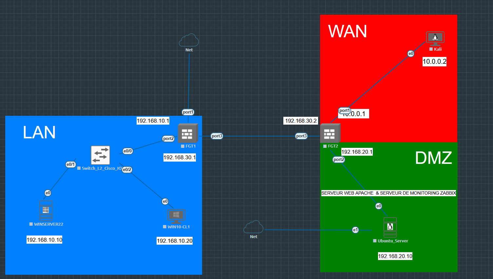

# Lab : FortiGate LAN / DMZ / WAN

## 🎯 Objectifs
- Mettre en place une architecture d’entreprise avec LAN, DMZ et WAN.
- Configurer deux pare-feu FortiGate pour sécuriser les flux.
- Déployer Active Directory (Windows Server 2022) et un client Windows 10.
- Installer un serveur web Apache + MariaDB + Zabbix (Ubuntu).
- Utiliser Kali Linux pour tester la sécurité.

## 📦 Prérequis
- EVE-NG installé avec images FortiGate, Windows Server 2022, Windows 10, Ubuntu et Kali.
- Git installé pour cloner le repo.
- 6 Go RAM minimum et CPU VT-x/AMD-V activé.

## 📌 Topologie


## 🖧 Plan IP
| Zone    | Appareil        | Adresse IP     |
|---------|----------------|----------------|
| LAN     | FGT1           | 192.168.10.1   |
| LAN     | WIN-SERVER22   | 192.168.10.10  |
| LAN     | WIN10-CL1      | 192.168.10.20  |
| DMZ     | FGT2           | 192.168.20.1   |
| DMZ     | Ubuntu Server  | 192.168.20.10  |
| Transit | FGT1           | 192.168.30.1   |
| Transit | FGT2           | 192.168.30.2   |
| WAN     | FGT2           | 10.0.0.1       |
| WAN     | Kali           | 10.0.0.2       |

## 🔧 Contenu du dossier
- `configs/FGT1.conf` → config de FGT1 (LAN ↔ Transit).
- `configs/FGT2.conf` → config de FGT2 (WAN ↔ DMZ ↔ Transit).
- `configs/WIN-SERVER22-notes.md` → configuration AD, DNS, DHCP.
- `configs/WIN10-CL1-notes.md` → configuration poste client.
- `configs/ubuntu-server-setup.sh` → script installation Apache + MariaDB + Zabbix.
- `configs/kali-notes.md` → outils de test Kali Linux.
- `scripts/setup.sh` → script pour préparer le lab.

## 🚀 Instructions
1. Cloner ce repo :
   ```bash
   git clone https://github.com/ton-compte/training-labs.git
   cd training-labs/fortigate-lan-dmz-wan
````

2. Importer la topologie dans **EVE-NG**.
3. Appliquer les configs des FortiGate :

   * `configs/FGT1.conf`
   * `configs/FGT2.conf`
4. Lancer le script d’installation sur Ubuntu :

   ```bash
   chmod +x configs/ubuntu-server-setup.sh
   ./configs/ubuntu-server-setup.sh
   ```
5. Tester la connectivité et la sécurité depuis Kali.

## ✅ Résultats attendus

* Les machines du LAN accèdent à Internet via FGT1 + FGT2.
* L’Ubuntu dans la DMZ héberge un site accessible depuis le LAN et le WAN.
* Zabbix surveille les hôtes du lab.
* Kali peut scanner et tester la sécurité du réseau.

## 🔮 Améliorations possibles

* Ajouter un IDS/IPS (ex : Snort ou Suricata).
* Déployer WSUS sur Windows Server.
* Intégrer CI/CD pour sauvegarder automatiquement les configs.

---

✍️ Auteur : **Landu Tamba Simplice**

````


